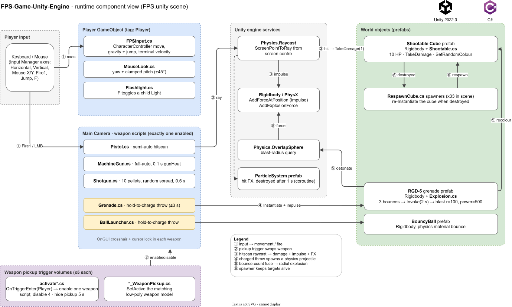

# FPS-Game-Unity-Engine

A first-person shooter prototype in Unity 2022.3 and C#. It has a CharacterController player, five weapon types (hitscan and physics projectiles), trigger-based weapon pickups, and physics targets that respawn.

[](https://unity.com/releases/editor/archive)
[](https://learn.microsoft.com/dotnet/csharp/)
[](LICENSE)



<sub>Editable source: [`docs/architecture.drawio`](docs/architecture.drawio) · PNG fallback: [`docs/architecture.png`](docs/architecture.png)</sub>

## Why this exists

This is a 2023 learning project. I built it to get hands-on with Unity's component model: how `MonoBehaviour` scripts on GameObjects talk to the physics engine (PhysX), to input, and to each other. The code is small on purpose (21 scripts, about 1,050 lines). It covers the basic building blocks of a shooter: movement, aiming, hit detection, projectile physics, explosions and a respawn loop.

It is a **prototype**. There is no enemy AI and no health or ammo HUD. The targets are passive physics cubes.

## What's technically interesting

| Concept | Where | Notes / trade-off |
| --- | --- | --- |
| **Kinematic character movement** | `Assets/Script/FPSInput.cs` | Moves with `CharacterController.Move` instead of a Rigidbody. You get predictable movement with no physics jitter, but gravity has to be done by hand: `vertSpeed` builds up `gravity * Time.deltaTime`, is clamped to a terminal velocity, and a small `-0.1` downward force keeps `isGrounded` stable. Movement is frame-rate independent through `Time.deltaTime`. |
| **Mouse look with pitch clamp** | `Assets/Script/MouseLook.cs` | Yaw and pitch are set through `localEulerAngles`, with pitch clamped to ±45° so the camera can't flip. An inspector enum lets the same script handle yaw-only, pitch-only or both. |
| **Hitscan weapons via raycasting** | `Pistol.cs`, `MachineGun.cs`, `Shotgun.cs` | `Camera.ScreenPointToRay` from the screen centre, then `Physics.Raycast`. On a hit the gun calls `Shootable.TakeDamage(1)`, applies `AddForceAtPosition` (impulse at the hit point, so the target spins) and spawns a particle effect oriented along the surface normal. A coroutine cleans up the effect after 1 s. Hitscan is cheap and exact, but there is no bullet travel time. |
| **Fire-rate limiting** | `MachineGun.cs`, `Shotgun.cs` | A `gunHeat` cooldown timer (0.1 s for full-auto, 0.5 s for the shotgun) instead of coroutines or `InvokeRepeating`. It is one float per weapon and easy to tune. |
| **Shotgun spread** | `Shotgun.cs` | 10 rays per shot. Each ray's direction is offset by `Random.insideUnitCircle * spreadAngle`, so the pellet pattern is circular rather than square. |
| **Physics projectiles with charge-up** | `Grenade.cs`, `BallLauncher.cs` | Hold the mouse button to charge, release to throw. Hold time is normalised over 3 s (`Mathf.Clamp01`) and converted into up to 200 extra impulse on an instantiated Rigidbody prefab. |
| **Bounce-count fuse and radial explosion** | `Assets/Script/Explosion.cs` (on `Prefabs/RGD-5.prefab`) | `OnCollisionEnter` counts bounces. After the 3rd bounce, `Invoke` detonates the grenade 2 s later: a `Physics.OverlapSphere` query, then `AddExplosionForce` on each `Shootable` Rigidbody in range, each of which is recoloured. |
| **Component contracts** | `Shootable.cs`, `Explosion.cs`, `FPSInput.cs` | `[RequireComponent]` guarantees a Rigidbody or CharacterController exists, so `hit.rigidbody` and `GetComponent<CharacterController>()` can't be null at runtime. |
| **Weapon switching via trigger volumes** | `activate*.cs`, `*_WeaponPickup.cs` | Walking into a pickup's trigger (`OnTriggerEnter`, `Player` tag) enables one weapon script on the camera and disables the other four. The pickup hides itself for 5 s, then a coroutine brings it back. A second script swaps the visible weapon model. |
| **Self-healing target field** | `Assets/Script/RespawnCube.cs` (33 spawners in `FPS.unity`) | Each spawner re-instantiates its `Shootable Cube` prefab as soon as the previous one is destroyed, so the range never runs out of targets. |

## How it works

These steps match the numbered edges in the diagram.

1. **Input.** The legacy Input Manager axes (`Horizontal`, `Vertical`, `Mouse X/Y`, `Jump`, `Fire1`) drive `FPSInput` and `MouseLook` on the Player. `F` toggles the flashlight.
2. **Weapon pickup.** Entering a pickup trigger enables exactly one weapon script on the Main Camera.
3. **Hitscan fire.** The active gun raycasts from screen centre. On a hit, the target takes 1 damage and receives an impulse, and a particle effect spawns at the hit point.
4. **Projectile fire.** The grenade and the ball launcher instantiate a Rigidbody prefab and push it forward with a hold-to-charge impulse.
5. **Explosion.** After 3 bounces plus a 2 s delay, the RGD-5 queries an overlap sphere and applies explosion force to every target in range, recolouring each one.
6. **Respawn.** A target is destroyed once its health drops below 0. Its `RespawnCube` spawner then instantiates a new one.

## Tech stack

| Layer | Tech |
| --- | --- |
| Engine | Unity 2022.3.4f1 LTS, built-in render pipeline, post-processing 3.2.2 |
| Language | C# (`MonoBehaviour` scripts) |
| Physics | Unity Physics (PhysX): `CharacterController`, `Rigidbody`, raycast and overlap queries |
| Input | Legacy Input Manager (`Input.GetAxis` / `GetButton`) |
| UI | `OnGUI` crosshair. TextMeshPro is imported but not used in the scene |
| Art | *Low Poly Weapons VOL.1*, *Stylized Lava Materials* (third-party asset packs in `Assets/`) |

## Getting started

**Prerequisites:** Unity Hub and **Unity 2022.3.4f1**. The exact version comes from `My project/ProjectSettings/ProjectVersion.txt`. Other 2022.3.x patch versions should open the project after an upgrade prompt.

```bash
git clone https://github.com/gcjk768/FPS-Game-Unity-Engine.git
```

1. Unity Hub → **Add → Add project from disk** → select the `My project/` folder (not the repo root).
2. Open `Assets/Scenes/FPS.unity`.
3. Press **Play**.

| Action | Input |
| --- | --- |
| Move / jump | `W` `A` `S` `D` / `Space` |
| Look | Mouse |
| Fire | Left mouse button. Hold, then release to throw the grenade or ball |
| Switch weapon | Walk into a weapon pickup |
| Flashlight | `F` |

## Project structure

```
My project/
├── Assets/
│   ├── Script/          # all 21 gameplay scripts (movement, weapons, pickups, targets)
│   ├── Scenes/FPS.unity # the only playable scene
│   ├── Prefabs/         # Shootable Cube, RGD-5 grenade, BouncyBall, Bullet, weapon models
│   ├── Materials/       # brick + lava materials
│   └── Low Poly Weapons VOL.1/, Stylized Lava Materials/, TextMesh Pro/  # third-party assets
├── Packages/manifest.json
└── ProjectSettings/     # incl. ProjectVersion.txt
docs/                    # architecture diagram (draw.io source, SVG, PNG)
```

## Testing & quality

There are no automated tests (no Unity Test Framework assemblies) and no CI. All verification was manual play-testing in the editor.

## Design decisions & limitations

These are the known limits, stated plainly:

- **No enemy AI.** There is no NavMesh, state machine or enemy that fights back. Targets are passive Rigidbody cubes.
- **Duplicated code.** The crosshair `OnGUI` and cursor-lock code is copied into all five weapon scripts. The five `activate*.cs` scripts are near-identical, and so are `Grenade.cs` and `BallLauncher.cs`. The next refactor would be an abstract `Weapon` base class (fire, cooldown and crosshair in one place) plus a single `WeaponPickup` script that takes a weapon index.
- **Weapon switching is hard-wired.** Each pickup names all five weapon components explicitly, so adding a sixth weapon means editing every pickup.
- **Grenades don't damage anything.** Explosions push and recolour targets but never call `TakeDamage`.
- **Off-by-one in `Shootable`.** It destroys the cube when `health < 0`, so a 10-HP cube takes 11 hits.
- **Legacy Input Manager and `OnGUI`** instead of the new Input System and a Canvas HUD.
- **Repo hygiene.** The root `.gitignore` uses root-anchored paths (`/[Ll]ibrary/`) but the Unity project lives in `My project/`. As a result, `Library/`, `Logs/`, `obj/` and `UserSettings/` were committed. The fix is to move the ignore file into `My project/` (or un-anchor the patterns) and `git rm -r --cached` those folders.

**Roadmap, if the project is revived:** a NavMesh enemy with a patrol → chase → attack state machine; a health and ammo HUD; a `Weapon` base class and ScriptableObject weapon data; PlayMode tests for damage and respawn.

---

James Koh · [GitHub](https://github.com/gcjk768) · MIT licensed ([LICENSE](LICENSE))
